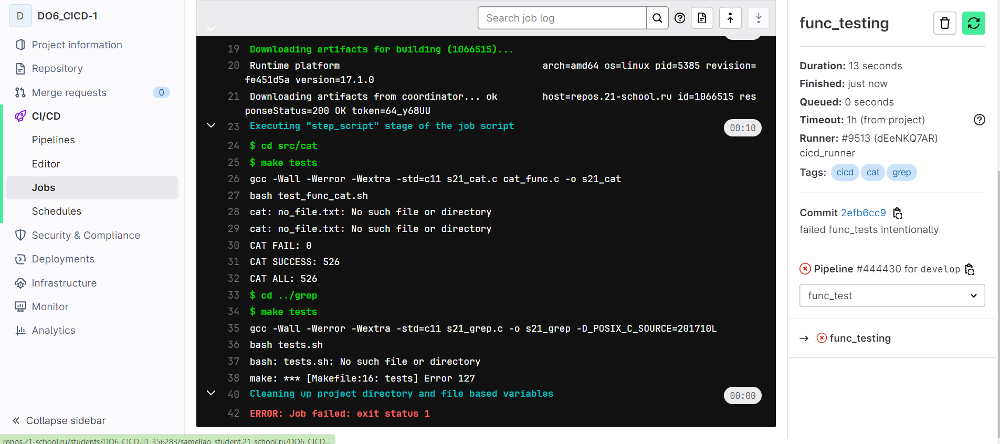

## Part 1. Настройка gitlab-runner

- Подняла виртуальную машину Ubuntu Server 22.04 LTS
- Скачала и установила на виртуальную машину gitlab-runner
 
 

## Part 2. Сборка

- Написала этап для CI по сборке приложений из проекта C2_SimpleBashUtils

- В файле gitlab-ci.yml добавила этап запуска сборки через мейк файл из проекта C2 и файлы, полученные после сборки (артефакты), сохранила в произвольную директорию со сроком хранения 30 дней
 
 

## Part 3. Тест кодстайла

- Написала этап для CI, который запускает скрипт кодстайла (clang-format). 
 
 
- Если кодстайл не прошел, то «фейлю» пайплайн. В пайплайне отобразила вывод утилиты clang-format.
 

## Part 4. Интеграционные тесты
- Написала этап для CI, который запускает мои интеграционные тесты из С2 автоматически только при условии, если сборка и тест кодстайла прошли успешно.
 
 

- Если тесты не прошли, то «зафейли» пайплайн. В пайплайне отобразила вывод, что интеграционные тесты успешно прошли / провалились.
 

## Part 5. Этап деплоя
- Написала этап для CD, который «разворачивает» проект на другой виртуальной машине вручную.
 

- Написала bash-скрипт, который при помощи ssh и scp копирует файлы, полученные после сборки (артефакты), в директорию /usr/local/bin второй виртуальной машины.
 

- каждой виртуальной машине добавила второй сетевой адаптер внутренней сети, назначила первой машине адрес 10.10.2.1, а второй - 10.10.2.2, пропинговала машины друг с друга и проверила, что между ними установилось соединение. На первой машине перешла в пользователя gitlab-runner, с которого сам gitlab-runner будет запускать скрипт, с помощью команды `sudo su gitlab-runner`. Так как я собираюсь логиниться в директорию root на второй машине необходимо создать пароль для root с помощью команды `passwd root`, а также в конфигурационном файле /etc/ssh/sshd_config раскомментировать строчку PermitRootLogin и поменять ее значение на yes. Далее на первой виртуалке сгенерировала shh-ключ типа rsa и с помощью команды `ssh-copy-id root@10.10.2.2` скопировала его в доверенные ключи второй машины. На этом этапе в первый раз необходимо ввести пароль от root директории, который мы задавали до этого. После успешного копирования и добавления ssh ключа можно зайти в root директорию второй машины с первой с помощью команды `ssh root@10.10.2.2`
 

- В случае ошибки «зафейли» пайплайн.
 

- В результате получила готовые к работе приложения из проекта C2_SimpleBashUtils (s21_cat и s21_grep) на второй виртуальной машине в директории /usr/local/bin
 
